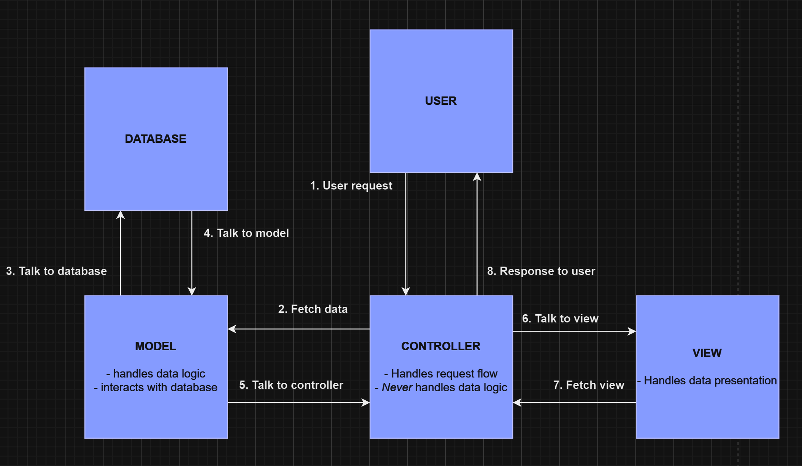

# Controllers

A controller is just a class which **controls how a user interacts** with an MVC application. MVC stands for **Model View Controller** - it's just a design pattern to help organise complex web applications. *An application is separated into 3 main components*:

- **MODEL**
- **VIEW**
- **CONTROLLER**

