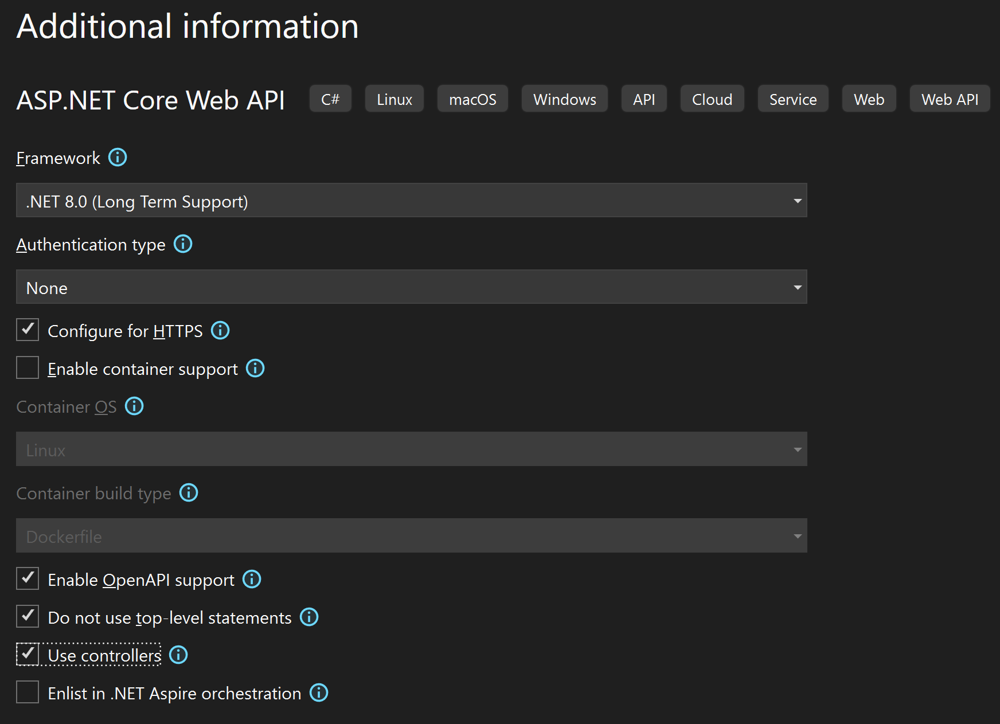

# Create a Web API in .NET

Following [this guide](https://learn.microsoft.com/en-us/aspnet/core/tutorials/first-web-api?view=aspnetcore-9.0&tabs=visual-studio) to build a Web API in .NET.

There are controller-based APIs and minimal APIs.

## Outline of the API

```GET /api/todoitems``` - get all to do items
```GET /api/todoitems/{id}``` - get to do items by ID
```POST /api/todoitems``` - add a new to do item
```PUT /api/todoitems{id}``` - update an existing to do item by id
```DELETE /api/todoitems{id}``` - delete a to do item by id

client -> HTTP request -> MVC app controller -> database
model -> serialise JSON body -> HTTP response -> client

## Visual Studio

- Create a new project
- Choose ASP.NET Core Web API 
- And check the 'use controllers' box for a controller-based API (you'd uncheck for a minimal API)



- Install the Entity Framework Core package: ```Microsoft.EntityFrameworkCore.InMemory```
- Run the project to check it works. The API is hosted at https://localhost:portnumber (randomly chosen port number, set at the project creation)
- If the port is incorrect, you will get a HTTP 404 not found
- Append **/weatherforecast** to the URL to test the WeatherForecast API and see the JSON response

## Add a model

A model is a set of classes which represent data that the application manages. For example:

```csharp
public class TodoItem
{
    public long Id { get; set; }
    public string? Name { get; set; }
    public bool IsComplete { get; set; }
}
```

The ID property is acting as the **unique key** (in a relational database).

## Add a database context

The database context is the main class used with Entity Framework for a data model. This derives from the 